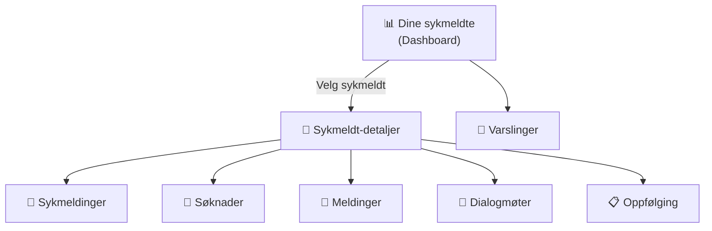

# Dinesykmeldte frontendapp

**Viktig:** For å komme i gang med bygging og kjøring av appen, les vår [wiki for Next.js-applikasjoner](https://github.com/navikt/esyfo-dev-tools/wiki/nextjs-build-run).

**Miljøer:**

- Produksjon: https://www.nav.no/arbeidsgiver/sykmeldte
- Utvikling (development): https://www.ekstern.dev.nav.no/arbeidsgiver/sykmeldte
- Demo: https://demo.ekstern.dev.nav.no/arbeidsgiver/sykmeldte

## Formålet med appen

Dinesykmeldte er en arbeidsgiver-portal som hjelper nærmeste leder og ledere med oppfølging av sykmeldte medarbeidere.

### Dashboard (hovedside)

Oversikt over alle sykmeldte med filtrering per virksomhet, sortering, varslinger og indikatorer for uleste elementer. Gir raskt avtrekk til detaljsider per sykmeldt.

### Sykmeldinger og søknader

Per sykmeldt vises sykmeldinger (perioder, aktivitetsbegrensninger, medisinske opplysninger) og søknader i statusene Ny, Fremtidig og Sendt. Lesestatus kan markeres på både sykmeldinger og søknader.

### Meldinger og oppfølging

Per sykmeldt finnes meldinger/hendelser og oppfølgingsaktiviteter, inkludert dialogmøter og aktivitetsvarsler. Lesestatus kan markeres på meldinger, og nærmeste-leder-informasjon er tilgjengelig som støtte i oppfølgingen.

### Infosider

Egne infosider med FAQ (spørsmål og svar) og veiledning for oppfølging av sykmeldte.

## Page routing

**basePath**[^basepath] `/arbeidsgiver/sykmeldte`

Appen har følgende hovedinngangs-punkter:

- **`/`** – Hoveddashboard med oversikt over alle sykmeldte ansatte
- **`/sykmeldt/[sykmeldtId]`** – Detaljside for spesifikk ansatt
  - **`/sykmeldt/[sykmeldtId]/sykmeldinger`** – Oversikt over sykmeldinger for ansatt
  - **`/sykmeldt/[sykmeldtId]/sykmelding/[id]`** – Detaljer for spesifikk sykmelding
  - **`/sykmeldt/[sykmeldtId]/soknader`** – Oversikt over søknader for ansatt
  - **`/sykmeldt/[sykmeldtId]/soknad/[id]`** – Detaljer for spesifikk søknad
  - **`/sykmeldt/[sykmeldtId]/meldinger`** – Meldinger/oppfølgingshistorikk for ansatt
  - **`/sykmeldt/[sykmeldtId]/melding/[id]`** – Detaljer for spesifikk melding
- **`/info`** – Informasjonssider
  - **`/info/sporsmal-og-svar`** – FAQ og spørsmål & svar
  - **`/info/oppfolging`** – Oppfølgingsveiledning

## Backend-API

Frontend-appen kommuniserer med [dinesykmeldte-backend](https://github.com/navikt/dinesykmeldte-backend) via REST API (samt intern GraphQL-integrasjon brukt internt i frontendlaget).

Brukte endepunkter:

- **GET** `/api/minesykmeldte` – Liste over sykmeldte ansatte
- **GET** `/api/virksomheter` – Liste over virksomheter
- **GET** `/api/sykmelding/{id}` – Detaljer for sykmelding
- **GET** `/api/soknad/{id}` – Detaljer for søknad
- **PUT** `/api/sykmelding/{id}/lest` – Marker sykmelding som lest
- **PUT** `/api/soknad/{id}/lest` – Marker søknad som lest
- **PUT** `/api/hendelse/{id}/lest` – Marker hendelse/aktivitetsvarsel som lest
- **PUT** `/api/hendelser/read` – Marker alle hendelser som lest
- **POST** `/api/narmesteleder/{id}/avkreft` – Koble fra ansatt (avkreft nærmeste leder)

**Autentisering:** OAuth2 token exchange (On-Behalf-Of flow) via `@navikt/oasis`

---

[^basepath]: `basePath`-verdien settes i Next.js-konfigurasjonen i `next.config.ts` og angir URL-prefikset som hele appen lever under.
